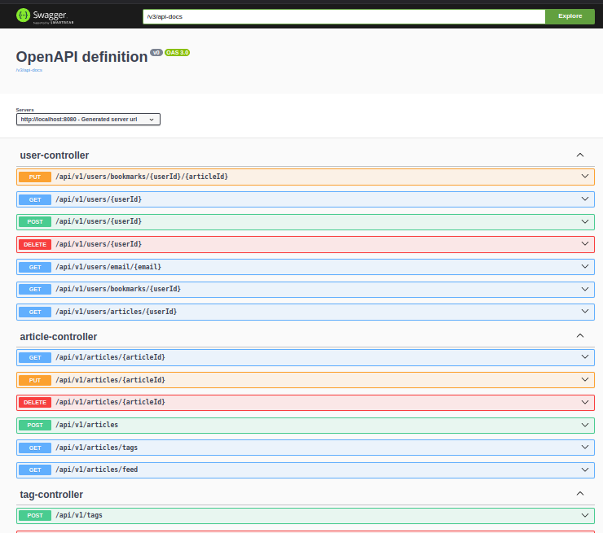

# Articles Spring Boot Backend Server

This is a Spring Boot backend server for managing articles in a blog application. It provides RESTful APIs for creating, reading, updating, and deleting articles, as well as managing users, article comments and tags.

## Features

- Create, update, and delete article
- Create, update, and delete articles comments
- Create, update, and delete articles tags
- Fetch articles with filtering options
- User authentication and authorization
- Swagger UI documentation for easy API exploration

## Technologies Used

- Spring Boot
- Spring Data JPA
- PostgreSQL Database (for development)
- Spring Security (for authentication)
- Swagger for API documentation
- Hibernate

## Getting Started

### Prerequisites

- Java 11 or higher
- Maven
- IDE (e.g., IntelliJ IDEA, Vscode)

### Clone the Repository

```bash
git clone https://github.com/yourusername/articles-spring-boot.git
cd articles-spring-boot
```


